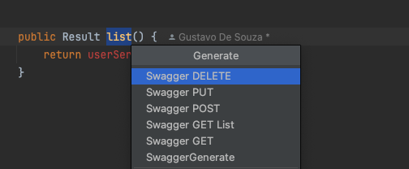

## introduce

This project is a plug-in for IntelliJ IDEA, which can help java developers automatically generate swagger annotations.
Supports 2021.3 and above versions

## Install

Open IntelliJ IDEA -> plugins, search for swagger-generate, install and restart

## Usage

- Select the classes, methods, and fields to be generated using the shortcut keys
  `alt+insert` (win) or `cmd + n` (mac) to open the menu and select SwaggerGenerate
-

- Use the shortcut `alt+insert` (win) or `cmd + n` (mac) on the class and select SwaggerGenerate

## Example

1. Generate a tag based on the Controller class name</p>

```java
@Tag(name = {"User api"})
public class UserController {
     //......
}
```

2. Generate Schema for Dto's automatically map primitive types to be required</p>

```java
public class UserDto {
    @Schema(description = "user name")
    private String name;
    @Schema(description = "user age")
    private Integer age;
    @Schema(required = true, description = "user age")
    private int primitiveTypes;
}
```

3. Generate generic mapping for methods</p>

```java
public class UserController {
    @Operation(summary = "get summary", description = "Get description",
            requestBody = @RequestBody(content = {@Content(schema = @Schema(implementation = DTO.class))}),
            responses = @ApiResponse(responseCode = "200", description = "Ok", content = {@Content(schema = @Schema(implementation = ResponseDto.class))}))
    public UserDto getUser(@Parameter(description = "user id") Long id) {
        // ....
    }
}
```


